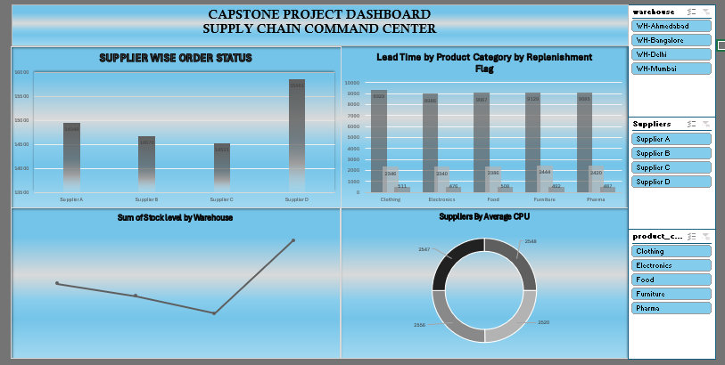

# 📊 Logistics Capstone Dashboard (Excel)

## 📊 Overview
This project presents an Excel-based dashboard analyzing logistics and supply chain performance using data-driven insights.

## 🎯 Objectives
- Analyze delivery performance 🚚  
- Track operational efficiency 📊  
- Identify trends and patterns ⏱️  

## 📊 Features
- KPI metrics (Orders, Cost, Delivery Time)  
- Trend analysis  
- Category & region insights  
- Interactive dashboard  

## 🛠 Tools Used
- Microsoft Excel  
- Pivot Tables  
- Data Visualization  

## 🖼 Dashboard Preview

## 📂 Project File
🔽 [Download Dashboard](logistics-capstone-dashboard.xlsx)

## 📈 Key Insights
- Identified performance trends across regions  
- Observed cost distribution patterns  
- Highlighted areas for operational improvement  

## 👩‍💻 Author

Shambhavi Tripathi

https://www.linkedin.com/in/shambhavi-tripathi-94bb9937a
  
https://github.com/shambhavi04august-hub
  
Logistics Professional 🚚 | Tech Enthusiast 💻 | Data-Driven 📊
